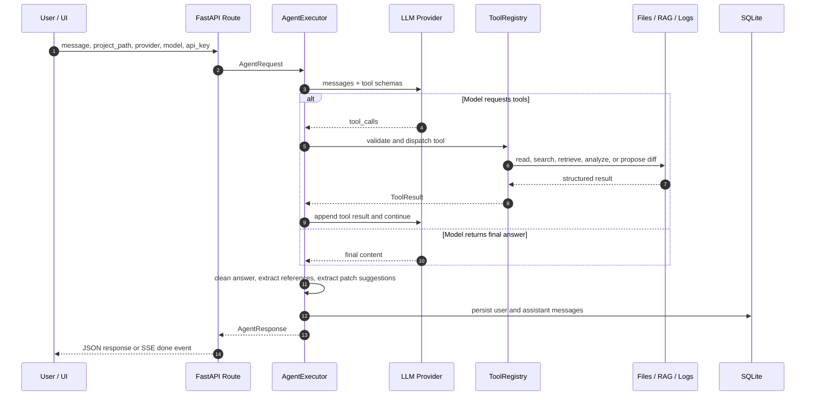

# AICodePilot

> A local-first AI coding workspace that connects an Agent loop, safe tools, code RAG, model providers, and a developer-friendly UI around real repositories.


AICodePilot is not a chatbot wrapper. It is an engineering-oriented AI Agent workspace for understanding, searching, debugging, and improving local codebases. The backend combines FastAPI, an Agent executor, OpenAI-compatible tool calling, safe file/search/log/patch tools, retrieval-augmented generation (RAG), SQLite conversation history, and provider abstraction. The frontend provides a focused three-column workspace for model selection, project indexing, chat, Agent trace, and code evidence.

> **中文用户快速提示**: AICodePilot 是一个本地优先的 AI 编程工作台。后端真实支持 `OpenAI` 和 `DeepSeek`，可以索引本地项目、调用安全工具、展示 Agent 执行轨迹和代码证据。最快启动方式见 [Quick Start](#-quick-start)，常见中文问题见 [FAQ](#-faq).

## Table of Contents

- [Why AICodePilot](#why-aicodepilot)
- [Features](#-features)
- [Screenshots and Demo](#-screenshots-and-demo)
- [Quick Start](#-quick-start)
- [Usage Guide](#-usage-guide)
- [Architecture](#-architecture)
- [Agent Runtime](#-agent-runtime)
- [Tech Stack](#-tech-stack)
- [Project Structure](#-project-structure)
- [Configuration](#-configuration)
- [Agent Development Guide](#-agent-development-guide)
- [API Reference](#-api-reference)
- [Deployment and Production](#-deployment-and-production)
- [Testing and Quality](#-testing-and-quality)
- [Security Model](#-security-model)
- [Roadmap](#-roadmap)
- [FAQ](#-faq)
- [Contributing](#-contributing)
- [License](#-license)

## Why AICodePilot

Modern coding assistants are most useful when they can inspect the same project context as the developer. AICodePilot is designed around that idea:

- **For beginners**: ask natural-language questions about a repository and get answers grounded in files, line references, and tool results.
- **For working developers**: trace where logic lives, search code semantically, analyze logs, and request safe patch suggestions without giving the Agent broad write access.
- **For AI Agent builders**: study a compact, test-covered implementation of tool calling, RAG, model provider abstraction, memory, streaming events, and frontend evidence panels.
- **For teams evaluating local AI workflows**: run the full stack locally or through Docker Compose, keep API keys client-provided, and leave shell execution disabled by default.

## ✨ Features

- 🧠 **Agentic coding loop**: a single-agent executor uses native OpenAI-compatible tool calling first, with a text-protocol fallback for providers that do not support function calling.
- 🔎 **Codebase RAG**: indexes local repositories, chunks source files by line ranges, embeds code, stores vectors, retrieves Top-K matches, and reranks results with code-aware signals.
- 🧰 **Safe tool registry**: built-in tools cover file listing, file reading, project trees, filename search, text search, code retrieval, log analysis, and diff-only patch proposals.
- 🛡️ **Security-first defaults**: path traversal checks, binary/large-file guards, bounded tool steps, optional shell execution, command allowlists, timeouts, and output truncation.
- 🔌 **Provider abstraction**: backend support currently includes `openai` and `deepseek`; per-request API keys and base URLs can override `.env` without mutating global settings.
- 🔑 **Bring your own key**: the frontend stores provider keys in browser `localStorage`; the backend uses them only for the current request and does not persist them.
- 🧾 **Traceable answers**: responses can include tool calls, code references, retrieved snippets, scores, and patch suggestions for easier verification.
- 📡 **SSE Agent events**: `/api/chat/stream` emits `thinking`, `tool_start`, `tool_end`, `done`, and `error` events so the UI can show Agent progress.
- 💬 **Short-term memory**: `conversation_id` keeps bounded in-memory context while SQLite stores user/assistant message history.
- 🖥️ **Three-column workspace**: Model Center, Workspace indexing, Chat, Agent Trace, and Code Evidence live in one Next.js interface.
- 🐳 **Local or Docker**: run with a PowerShell helper script, manual backend/frontend commands, or Docker Compose with host project path mapping.
- ✅ **Regression coverage**: backend tests cover Agent behavior, providers, tools, RAG, API routes, memory, database persistence, and streaming; frontend tests cover core UI behavior.

## 📸 Screenshots and Demo

The repository does not currently include committed screenshots or GIFs. Because AICodePilot has a real UI, adding visual assets will make the GitHub landing page much more effective.

Recommended assets:

| Asset | Suggested path | What it should show |
|---|---|---|
| Workspace screenshot | `docs/assets/workspace.png` | Model Center, project indexing, chat, Agent Trace, and Code Evidence |
| Agent trace GIF | `docs/assets/agent-trace.gif` | A question triggering tool calls and returning code references |
| RAG evidence screenshot | `docs/assets/code-evidence.png` | Retrieved files, line numbers, snippets, and scores |

Suggested Markdown once assets are added:

```md

```

## 🚀 Quick Start

### Prerequisites

| Dependency | Recommended version | Used for |
|---|---:|---|
| Python | 3.10+ | FastAPI backend, Agent runtime, RAG, tests |
| Node.js | 20+ | Next.js frontend |
| npm | Bundled with Node.js | Frontend dependency management |
| Docker Desktop | Optional | Docker Compose demo deployment |

### 1. Clone the repository

```bash
git clone <your-repository-url>
cd ai-code-pilot
```

### 2. Create your environment file

```powershell
Copy-Item .env.example .env
```

At minimum, configure one chat provider:

```env
# OpenAI
LLM_PROVIDER=openai
OPENAI_API_KEY=your_openai_api_key
OPENAI_BASE_URL=https://api.openai.com/v1
OPENAI_MODEL=gpt-5.2

# Or DeepSeek
LLM_PROVIDER=deepseek
DEEPSEEK_API_KEY=your_deepseek_api_key
DEEPSEEK_BASE_URL=https://api.deepseek.com
DEEPSEEK_MODEL=deepseek-v4-pro
```

For local-first code search without an embedding API key, use:

```env
EMBEDDING_PROVIDER=local
```

> Note: `.env.example` currently sets `EMBEDDING_PROVIDER=openai`, while the code default is `local`. If you want zero-key local embeddings, set `EMBEDDING_PROVIDER=local` explicitly.

### 3. Start the full stack with one command

On Windows / PowerShell:

```powershell
powershell -ExecutionPolicy Bypass -File scripts/start-local.ps1
```

First run with dependency installation:

```powershell
powershell -ExecutionPolicy Bypass -File scripts/start-local.ps1 -Install
```

Then open:

| Service | URL |
|---|---|
| Frontend | `http://localhost:3000` |
| Backend API | `http://localhost:8000` |
| OpenAPI docs | `http://localhost:8000/docs` |

The startup script opens separate PowerShell windows for the backend and frontend. Stop either service with `Ctrl+C` in its terminal window.

### 4. Ask your first Agent question

1. Open `http://localhost:3000`.
2. Select `OpenAI` or `DeepSeek` in **Model Center**.
3. Enter your API key or rely on `.env` credentials.
4. Set a backend-visible project path in **Workspace**.
5. Click **Index Workspace**.
6. Ask:

```text
Where is the Agent execution flow implemented? Cite the files you used.
```

### 5. Manual startup

Backend:

```powershell
cd backend
python -m venv .venv
.\.venv\Scripts\Activate.ps1
pip install -r requirements.txt
python -m uvicorn app.main:app --reload
```

Frontend:

```powershell
cd frontend
npm install
npm run dev
```

If backend dependency installation fails because `httpx2` cannot be resolved, replace `httpx2` with `httpx` in `backend/requirements.txt`. The source code imports `httpx`.

## 📖 Usage Guide

### Web workspace workflow

The UI is designed as a developer cockpit:

| Panel | Purpose |
|---|---|
| Model Center | Select provider, model, API key, and provider base URL |
| Workspace | Set or preview a project path, then build a RAG index |
| AI Assistant | Ask repository-aware questions |
| Agent Trace | Inspect tool calls and execution progress |
| Code Evidence | Review retrieved snippets, paths, line numbers, and scores |

Useful prompts:

```text
Explain the backend architecture in this repository.
```

```text
Find the FastAPI route that handles streaming chat and explain the event format.
```

```text
Analyze this error log and suggest the most likely source file:
<paste log here>
```

```text
Suggest a safe patch for the provider model discovery flow. Do not modify files.
```

### API usage

Health check:

```bash
curl http://localhost:8000/api/health
```

Synchronous Agent chat:

```bash
curl -X POST http://localhost:8000/api/chat \
  -H "Content-Type: application/json" \
  -d '{
    "message": "Where is configuration loaded?",
    "project_path": "D:/MyWork/Code/ai-code-pilot",
    "provider": "deepseek",
    "model": "deepseek-v4-pro"
  }'
```

Index a project for RAG:

```bash
curl -X POST http://localhost:8000/api/projects/index \
  -H "Content-Type: application/json" \
  -d '{
    "project_path": "D:/MyWork/Code/ai-code-pilot"
  }'
```

Search indexed code:

```bash
curl -X POST http://localhost:8000/api/projects/search \
  -H "Content-Type: application/json" \
  -d '{
    "query": "tool registry design",
    "top_k": 5
  }'
```

Fetch provider models with a user-supplied key:

```bash
curl -X POST http://localhost:8000/api/providers/models \
  -H "Content-Type: application/json" \
  -d '{
    "provider": "openai",
    "api_key": "your_api_key",
    "base_url": "https://api.openai.com/v1"
  }'
```

### Streaming chat

`POST /api/chat/stream` returns Server-Sent Events:

```text
event: thinking
data: {"step":1}

event: tool_start
data: {"tool":"read_file","arguments":{"file_path":"backend/app/main.py"}}

event: tool_end
data: {"tool":"read_file","error":null}

event: done
data: {"answer":"...","conversation_id":"...","tool_calls":[...],"references":[...]}
```

The frontend consumes POST-based SSE with `fetch` and `ReadableStream` in `frontend/lib/sse.ts`, because the browser-native `EventSource` API only supports GET.

### CLI entry point

The backend also keeps a minimal CLI entry:

```powershell
cd backend
python -m app.main --project-path ..
```

## 🏗️ Architecture

AICodePilot is split into five practical layers:

1. **Experience layer**: Next.js workspace for model configuration, project indexing, chat, trace, and evidence review.
2. **API layer**: FastAPI routes for chat, streaming, project indexing/search, model discovery, health checks, and session history.
3. **Agent runtime**: an executor that manages tool-calling steps, loop detection, final answer synthesis, memory, and result extraction.
4. **Tool and retrieval layer**: safe tools for files/search/logs/patches plus a RAG pipeline for repository evidence.
5. **Persistence layer**: SQLite for conversations and Chroma/JSON/memory vector stores for retrieval data.

```mermaid
flowchart TB
  User["Developer / Team"] --> Browser["Next.js Workspace UI"]

  subgraph UX["Frontend Experience"]
    Browser
    ModelCenter["Model Center"]
    WorkspacePanel["Workspace Indexing"]
    ChatPanel["AI Assistant"]
    TracePanel["Agent Trace"]
    EvidencePanel["Code Evidence"]
  end

  Browser --> ModelCenter
  Browser --> WorkspacePanel
  Browser --> ChatPanel
  Browser --> TracePanel
  Browser --> EvidencePanel

  subgraph API["FastAPI Backend"]
    Health["GET /api/health"]
    Chat["POST /api/chat"]
    Stream["POST /api/chat/stream"]
    Projects["POST /api/projects/index\nPOST /api/projects/search"]
    Models["POST /api/providers/models"]
    Sessions["GET /api/sessions/{id}/messages\nDELETE /api/sessions/{id}"]
  end

  Browser --> Chat
  Browser --> Stream
  Browser --> Projects
  Browser --> Models
  Browser --> Sessions

  subgraph Agent["Agent Runtime"]
    Facade["AICodePilotAgent"]
    Executor["AgentExecutor\nstep budget + loop detection"]
    Memory["ConversationMemory\nbounded recent turns"]
    Planner["Text protocol parser\nfallback path"]
    Events["AgentEvent stream"]
  end

  Chat --> Facade
  Stream --> Facade
  Facade --> Executor
  Executor <--> Memory
  Executor -. fallback .-> Planner
  Executor --> Events
  Events --> Stream

  subgraph ModelLayer["LLM Provider Layer"]
    Factory["LLMProviderFactory"]
    OpenAI["OpenAIProvider"]
    DeepSeek["DeepSeekProvider"]
    RemoteLLM["OpenAI-compatible\n/chat/completions"]
  end

  Executor --> Factory
  Factory --> OpenAI
  Factory --> DeepSeek
  OpenAI --> RemoteLLM
  DeepSeek --> RemoteLLM
  Models --> RemoteLLM

  subgraph Tools["Safe Tool Layer"]
    Registry["ToolRegistry"]
    FileTools["list_files\nread_file\nproject_tree\nfind_files"]
    SearchTool["search_text"]
    RagTool["retrieve_code"]
    LogTool["analyze_log"]
    PatchTool["propose_patch\ndiff only"]
    ShellTool["run_command\noptional allowlist"]
  end

  Executor --> Registry
  Registry --> FileTools
  Registry --> SearchTool
  Registry --> RagTool
  Registry --> LogTool
  Registry --> PatchTool
  Registry -. ENABLE_SHELL_TOOL=true .-> ShellTool

  subgraph Retrieval["Repository Intelligence / RAG"]
    Indexer["ProjectIndexer"]
    Chunker["CodeChunker\n80-line chunks + overlap"]
    Embeddings["Local hash embeddings\nor OpenAI embeddings"]
    VectorStore["Chroma / JSON / Memory"]
    Retriever["CodeRetriever\nTop-K + hybrid rerank"]
  end

  Projects --> Indexer
  RagTool --> Retriever
  Indexer --> Chunker
  Chunker --> Embeddings
  Embeddings --> VectorStore
  VectorStore --> Retriever

  subgraph Storage["Persistence"]
    SQLite[("SQLite\nconversations + messages")]
    VectorData[("data/vector_store")]
  end

  Chat --> SQLite
  Stream --> SQLite
  Sessions --> SQLite
  VectorStore --> VectorData
```



### Agent execution flow



## 🤖 Agent Runtime

The current implementation is a **single-agent system**. It does not implement multi-agent collaboration yet. The design is intentionally compact and inspectable:

| Component | Location | Responsibility |
|---|---|---|
| Agent facade | `backend/app/agent/agent.py` | Public Agent entry point |
| Executor | `backend/app/agent/executor.py` | Tool-calling loop, loop detection, finalization, memory integration |
| Prompts | `backend/app/agent/prompts.py` | System prompts for tool calling and fallback protocol |
| Planner | `backend/app/agent/planner.py` | Parses fallback text protocol actions |
| Events | `backend/app/agent/events.py` | SSE event schema |
| Schemas | `backend/app/agent/schemas.py` | Agent request/response/tool/reference models |

Important runtime behavior:

- `AGENT_MAX_STEPS` defaults to `10` and is validated between `3` and `30`.
- Native tool calling is preferred through `chat_with_tools`.
- If a provider does not support tool calling, the executor can fall back to a text protocol parser.
- Identical back-to-back tool calls are detected to reduce runaway loops.
- Tool payloads are excluded from rolling memory; only the raw user message and final assistant answer are remembered.
- `answer_delta` is reserved in the event schema, but current streaming is step/tool-event oriented rather than token-level streaming.

## 🛠️ Tech Stack

| Layer | Technology |
|---|---|
| Backend API | Python 3.10, FastAPI, Uvicorn |
| Settings | Pydantic, pydantic-settings, `.env` loading |
| Database | SQLModel, SQLite |
| LLM layer | OpenAI-compatible Chat Completions, OpenAI provider, DeepSeek provider |
| Agent | Custom executor, tool schemas, bounded memory, fallback planner |
| Tools | File/search/log/RAG/patch tools, optional allowlisted shell tool |
| RAG | Project scanner, line chunker, local hash embeddings, OpenAI embeddings, ChromaDB, JSON/memory store |
| Frontend | Next.js 15, React 18, TypeScript 5.7 |
| UI | Tailwind CSS, lucide-react, react-markdown, remark-gfm, rehype-highlight |
| Testing | pytest, Vitest, Testing Library |
| Quality | Ruff, Black, mypy, ESLint, TypeScript |
| Deployment | PowerShell local script, Dockerfiles, Docker Compose |
| CI | GitHub Actions backend quality workflow |

## 📁 Project Structure

```text
.
|-- backend/
|   |-- app/
|   |   |-- agent/      # Agent facade, executor, planner, prompts, schemas, events
|   |   |-- api/        # FastAPI routers and request/response schemas
|   |   |-- core/       # settings, logging, exceptions, filesystem safety
|   |   |-- db/         # SQLModel models, engine, repository
|   |   |-- llm/        # provider abstraction, OpenAI, DeepSeek, HTTP client
|   |   |-- memory/     # bounded conversation memory and session store
|   |   |-- rag/        # indexer, chunker, embeddings, vector store, retriever
|   |   `-- tools/      # safe tools for files, search, logs, RAG, shell, patches
|   |-- tests/          # backend test suite
|   |-- Dockerfile
|   `-- requirements.txt
|-- frontend/
|   |-- app/            # Next.js app entry and global styles
|   |-- components/     # workspace UI, model selector, timeline, evidence panels
|   |-- hooks/          # chat, provider config, auth demo, workspace import
|   |-- lib/            # typed API client and SSE parser
|   |-- tests/          # frontend tests
|   |-- Dockerfile
|   `-- package.json
|-- docs/               # architecture, API, deployment, security, Agent, RAG docs
|-- scripts/
|   `-- start-local.ps1 # local full-stack startup helper
|-- data/               # runtime data directory, ignored except .gitkeep
|-- .github/workflows/  # CI workflow
|-- docker-compose.yml
|-- pyproject.toml
|-- pytest.ini
|-- .env.example
`-- README.md
```

## 🔧 Configuration

Configuration is loaded from environment variables and `.env`.

| Variable | Default / example | Description |
|---|---|---|
| `APP_NAME` | `AICodePilot` | Service name |
| `APP_ENV` | `development` | Runtime environment |
| `LOG_LEVEL` | `INFO` | Log level; validated against standard Python levels |
| `LLM_PROVIDER` | `openai` | Default provider; supported values: `openai`, `deepseek` |
| `LLM_MODEL` | `gpt-5.2` | Optional global model override |
| `OPENAI_API_KEY` | placeholder | OpenAI API key |
| `OPENAI_BASE_URL` | `https://api.openai.com/v1` | OpenAI-compatible base URL |
| `OPENAI_MODEL` | `gpt-5.2` | Default OpenAI model |
| `DEEPSEEK_API_KEY` | placeholder | DeepSeek API key |
| `DEEPSEEK_BASE_URL` | `https://api.deepseek.com` | DeepSeek base URL |
| `DEEPSEEK_MODEL` | `deepseek-v4-pro` | Default DeepSeek model |
| `EMBEDDING_PROVIDER` | code default: `local` | Supported values: `local`, `openai` |
| `EMBEDDING_MODEL` | `text-embedding-3-small` | OpenAI embedding model when `EMBEDDING_PROVIDER=openai` |
| `VECTOR_STORE_BACKEND` | `chroma` | Supported values: `chroma`, `json`, `memory` |
| `VECTOR_STORE_PATH` | `./data/vector_store` | Persistent vector store directory |
| `DATABASE_URL` | `sqlite:///./data/aicodepilot.db` | SQLite database URL |
| `AGENT_MAX_STEPS` | `10` | Maximum Agent tool steps, range `3` to `30` |
| `ENABLE_SHELL_TOOL` | `false` | Enables the allowlisted shell tool when set to `true` |
| `CORS_ALLOWED_ORIGINS` | `http://localhost:3000,http://127.0.0.1:3000` | Backend CORS allowlist |
| `NEXT_PUBLIC_API_BASE_URL` | `http://localhost:8000` | Frontend API base URL |
| `NEXT_PUBLIC_DEFAULT_PROJECT_PATH` | `.` | Frontend default project path |
| `PROJECTS_HOST_ROOT` | `.` | Host project root for Docker path mapping |
| `PROJECTS_CONTAINER_ROOT` | `/workspace` | Container project root for Docker path mapping |
| `PYTHON_IMAGE` | `python:3.10-slim` | Docker backend base image |
| `NODE_IMAGE` | `node:20-alpine` | Docker frontend base image |

### Provider support

| Provider | Backend support | UI status |
|---|---|---|
| OpenAI | Supported | Available |
| DeepSeek | Supported | Available |
| Qwen | Not yet implemented in backend | Shown as coming soon |
| Zhipu GLM | Not yet implemented in backend | Shown as coming soon |
| Claude | Not yet implemented in backend | Shown as coming soon |

## 🤖 Agent Development Guide

### Add a custom tool

1. Create a new tool class under `backend/app/tools/`.
2. Subclass `BaseTool`.
3. Define `name`, `description`, an argument schema, and `run(...)`.
4. Register it in `create_default_registry()` in `backend/app/tools/registry.py`.
5. Add tests under `backend/tests/`.

Minimal shape:

```python
from pydantic import BaseModel, Field

from app.tools.base import BaseTool


class MyToolArgs(BaseModel):
    query: str = Field(..., description="What to inspect")


class MyTool(BaseTool):
    name = "my_tool"
    description = "Describe what this tool does and when the Agent should use it."
    args_schema = MyToolArgs

    def run(self, query: str) -> dict[str, object]:
        return {"query": query, "result": "structured data only"}
```

Tool design tips:

- Return structured JSON-friendly data, not long prose.
- Keep filesystem operations inside the project root.
- Add explicit size limits and timeouts for expensive operations.
- Prefer read-only behavior unless the user explicitly reviews and approves changes.

### Add a new LLM provider

1. Implement a provider under `backend/app/llm/`.
2. Subclass `BaseLLMProvider`.
3. Implement `chat(...)` and, ideally, `chat_with_tools(...)`.
4. Register the provider in `LLMProviderFactory`.
5. Add configuration fields in `backend/app/core/config.py`.
6. Add tests similar to the OpenAI and DeepSeek provider tests.

Current provider implementation expects OpenAI-compatible chat completions. A provider without function-calling support can still work through the fallback text protocol, but native tool calling gives better Agent reliability.

### Extend RAG behavior

The RAG pipeline is intentionally modular:

| Need | Where to start |
|---|---|
| Change file inclusion/exclusion | `backend/app/rag/indexer.py` |
| Change chunking strategy | `backend/app/rag/chunker.py` |
| Change embeddings | `backend/app/rag/embeddings.py` |
| Change vector storage | `backend/app/rag/vector_store.py` |
| Change ranking | `backend/app/rag/retriever.py` |
| Expose retrieval to Agent | `backend/app/tools/rag_tools.py` |

## 📡 API Reference

| Method | Path | Purpose |
|---|---|---|
| `GET` | `/api/health` | Service health check |
| `POST` | `/api/chat` | Synchronous Agent chat |
| `POST` | `/api/chat/stream` | SSE Agent chat |
| `POST` | `/api/projects/index` | Build a project RAG index and return a project summary |
| `POST` | `/api/projects/search` | Search indexed code snippets |
| `POST` | `/api/providers/models` | Fetch available models from a provider using a supplied key |
| `GET` | `/api/sessions/{conversation_id}/messages` | Fetch persisted conversation messages |
| `DELETE` | `/api/sessions/{conversation_id}` | Delete a conversation and clear session state |

More detailed docs:

- [API](docs/api.md)
- [Streaming Protocol](docs/streaming.md)
- [Model Discovery](docs/model-discovery.md)
- [Agent Design](docs/agent-design.md)
- [RAG Design](docs/rag-design.md)
- [Security](docs/security.md)

## 📈 Deployment and Production

### Docker Compose

```powershell
Copy-Item .env.example .env
docker compose up --build
```

Docker path mapping matters. The backend can only index paths visible inside the container. Configure:

```env
PROJECTS_HOST_ROOT=D:/code/my_projects
PROJECTS_CONTAINER_ROOT=/workspace
NEXT_PUBLIC_DEFAULT_PROJECT_PATH=/workspace
VECTOR_STORE_PATH=/app/data/vector_store
```

Then use `/workspace/...` as the project path in the UI or API.

### Production checklist

- Keep `ENABLE_SHELL_TOOL=false` unless running in a trusted, isolated environment.
- Store real secrets in your deployment platform, not in committed files.
- Restrict `CORS_ALLOWED_ORIGINS` to the deployed frontend origin.
- Mount persistent volumes for SQLite and vector store data.
- Add production authentication before exposing the app beyond a trusted local network.
- Review provider key handling if moving from BYOK local usage to team-managed credentials.
- Add frontend build/test gates to CI if the UI becomes part of production release criteria.
- Add screenshots, release notes, issue templates, and a public CI badge before publishing widely.

## 🧪 Testing and Quality

Backend:

```powershell
pytest backend/tests
ruff check .
black --check .
mypy backend/app
```

Frontend:

```powershell
cd frontend
npm run typecheck
npm run lint
npm run test
npm run build
```

Current GitHub Actions workflow runs backend quality gates on pushes and pull requests to `main`:

- `ruff check .`
- `black --check .`
- `mypy backend/app`
- `pytest backend/tests`

## 🛡️ Security Model

AICodePilot works with local code, so the default posture is conservative:

- File tools validate project-root boundaries and reject path traversal.
- `read_file` blocks binary files and oversized reads.
- RAG indexing skips `.git`, virtual environments, `node_modules`, build outputs, caches, temporary directories, and tests.
- `run_command` is disabled unless `ENABLE_SHELL_TOOL=true`.
- The shell tool uses `shell=False`, command allowlists, project-root working directory checks, timeouts, and output limits.
- `propose_patch` returns unified diff suggestions only; it does not write files.
- Browser-stored API keys are sent per request and are not persisted by the backend.
- The current frontend auth/profile/captcha flow is a local demo, not production authentication.

Read more in [docs/security.md](docs/security.md).

## 🗺️ Roadmap

Based on the current repository docs and implementation state:

- [ ] Add backend providers for Qwen, GLM, Claude, Gemini, Moonshot, and other OpenAI-compatible vendors.
- [ ] Improve repository intelligence with dependency graphs, call graphs, framework detection, and security scan hooks.
- [ ] Expand patch workflows from diff suggestion to reviewable multi-file patch plans.
- [ ] Replace demo-only frontend auth with real backend authentication and user/session management.
- [ ] Add stronger frontend regression coverage and include frontend gates in CI.
- [ ] Improve large-project import limits, progress reporting, and browser-side warnings.
- [ ] Add official screenshots, GIF demos, release checklist, and public repository metadata.

## ❓ FAQ

<details>
<summary>Is AICodePilot a multi-agent framework?</summary>

Not yet. The current system is a single-agent coding workspace with tools, RAG, memory, and provider abstraction. Multi-agent collaboration is a natural future direction, but it is not implemented in the current codebase.
</details>

<details>
<summary>Does the Agent modify my files?</summary>

No built-in tool writes code changes automatically. `propose_patch` generates unified diff suggestions only. File modification workflows should remain human-reviewed unless you explicitly add a write/apply tool.
</details>

<details>
<summary>Can I use AICodePilot without an embedding API key?</summary>

Yes for code retrieval embeddings: set `EMBEDDING_PROVIDER=local`. Chat still requires a supported LLM provider key unless your environment provides compatible credentials elsewhere.
</details>

<details>
<summary>Why can the browser select a folder, but the backend still cannot index it?</summary>

Browser folder selection is only a frontend preview. The backend can index only paths it can access on the machine or inside the Docker container. In Docker, use `PROJECTS_HOST_ROOT` and `PROJECTS_CONTAINER_ROOT` to mount projects.
</details>

<details>
<summary>Which model providers are actually supported?</summary>

The backend currently supports `openai` and `deepseek`. Qwen, GLM, and Claude appear in the UI as coming-soon provider options, but they do not have backend provider implementations yet.
</details>

<details>
<summary>Can I enable shell commands?</summary>

Yes, set `ENABLE_SHELL_TOOL=true`. Use it only in trusted local environments. The shell tool is allowlisted and bounded, but any LLM-controlled shell capability increases risk.
</details>

<details>
<summary>中文用户如何最快开始?</summary>

1. 复制 `.env.example` 为 `.env`。
2. 配置 `OPENAI_API_KEY` 或 `DEEPSEEK_API_KEY`。
3. 如果不想配置 embedding key，设置 `EMBEDDING_PROVIDER=local`。
4. 运行 `powershell -ExecutionPolicy Bypass -File scripts/start-local.ps1 -Install`。
5. 打开 `http://localhost:3000`，选择模型，填写项目路径，点击 `Index Workspace`，然后开始提问。
</details>

<details>
<summary>Why does backend dependency installation fail on <code>httpx2</code>?</summary>

The current `backend/requirements.txt` lists `httpx2`, while the source imports `httpx`. If your installer cannot resolve `httpx2`, replace it with `httpx` until the dependency file is corrected.
</details>

## 🤝 Contributing

Contributions are welcome. Good contributions keep the Agent reliable, observable, and safe.

Suggested workflow:

1. Fork the repository and create a focused branch.
2. Read [Development Guide](docs/development-guide.md), [Agent Design](docs/agent-design.md), and [Security](docs/security.md).
3. Keep changes scoped; avoid unrelated refactors.
4. Add or update tests for backend behavior changes.
5. Add frontend tests or manual verification notes for UI changes.
6. Run the relevant quality gates before opening a pull request.
7. In the PR description, include the motivation, changed files, verification commands, and known risks.

Recommended commit style:

```text
feat: add provider model discovery
fix: harden project path normalization
docs: refresh quick start guide
test: cover streaming chat events
```

## 📚 Documentation

- [Architecture](docs/architecture.md)
- [Agent Design](docs/agent-design.md)
- [RAG Design](docs/rag-design.md)
- [API](docs/api.md)
- [Streaming Protocol](docs/streaming.md)
- [Model Discovery](docs/model-discovery.md)
- [Security](docs/security.md)
- [Deployment](docs/deployment.md)
- [User Guide](docs/user-guide.md)
- [Development Guide](docs/development-guide.md)
- [Roadmap / Todo](docs/todolist.md)

## 📄 License

AICodePilot is released under the [MIT License](LICENSE).

## 👥 Authors and Community

Maintained by AICodePilot contributors.

Before publishing this repository publicly, consider adding:

- Public GitHub repository URL and CI badge
- Maintainer GitHub handles
- Issue templates and pull request template
- Discussions or community channel
- Screenshots and release assets
